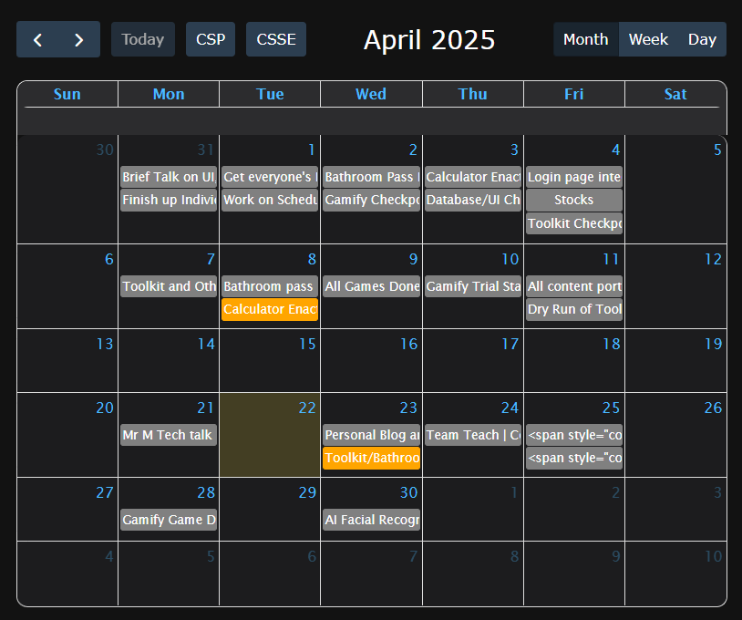

# CSA 2025 - Matthew Wang

This blog serves to document my work and experience in CSA in the 2024-25 school year. 

## Where can I find content?
All of the content posted on this blog can be found under the "Blogs" link in the navigation menu. You may comment on most posts by using Github Utterances. 

<button class="dropbtn">Lost? Check one of these out! ↓</button>

<a href="{{site.baseurl}}/about/" target = "_blank">About Me</a>
<a href="{{site.baseurl}}/reflection/cyber" target = "_blank">Cybersecurity</a>
<a href = "{{site.baseurl}}/AP-Study" target = "_blank">The AP Exam...</a>

## Current Main Project:

<a href = "https://nighthawkcoders.github.io/portfolio_2025/student/calendar" target = "_blank">Calendar</a>

